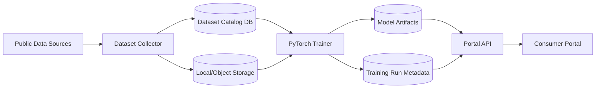

# Long-Term Architecture

The project should evolve into three cooperating services plus a shared contract package.

## Services

### Portal API

Path: `backend/`

Purpose:

- Serve the consumer portal
- Expose cost-estimate APIs
- Read the active model metadata
- Call model inference code or a future dedicated inference service

The portal should not download public datasets or train models.

### Dataset Collector

Path: `services/dataset-collector/`

Purpose:

- Register public data sources
- Download or mirror source files
- Compute checksums
- Normalize raw files into canonical dataset versions
- Track which dataset versions are eligible for training
- Expose a dataset catalog API
- Run bounded data-collection agents that propose dataset versions

This service owns dataset lineage.

### Trainer

Path: `services/trainer/`

Purpose:

- Discover trainable dataset versions
- Start PyTorch training runs
- Save model artifacts and metrics
- Register which dataset versions were used by each run
- Promote a model candidate to active after evaluation
- Execute the first PyTorch provider-payment training path for CMS datasets

This service owns model lineage.

### Shared Contracts

Path: `packages/shared/`

Purpose:

- Shared Pydantic models
- Dataset status names
- Training run status names
- Common API request/response shapes

Shared contracts should stay small. Do not put business logic here.

## State Model

The long-term production setup should use PostgreSQL for metadata and object storage for large files.

Local development also uses PostgreSQL. Large raw files, normalized datasets, and model artifacts should live in local/object storage, not in Postgres.

Metadata:

- `data_sources`
- `dataset_versions`
- `training_runs`
- `training_run_datasets`
- `model_artifacts`

Object/file storage:

- Raw source files
- Normalized parquet/CSV files
- Trained PyTorch `.pt` files
- Preprocessors
- Metrics JSON
- Data profiles

## Dataset Version Lifecycle

```text
registered -> downloading -> downloaded -> normalized -> validated -> trainable -> archived
                         \-> failed
```

Rules:

- Every downloaded file gets a checksum.
- Raw files are stored outside Postgres and referenced by URI.
- Every normalized dataset gets a schema version.
- Training runs reference immutable dataset versions.
- If source data changes, create a new dataset version.

## Agent Boundary

Collection agents should produce auditable proposals, not untracked side effects.

Rules:

- Agent runs are persisted in `agent_runs`.
- Proposals include rationale, source URL, and metadata.
- Initial agents are deterministic and allowlist-based.
- Automatic downloads stay disabled until source trust and file size policies are mature.
- Applying an agent run registers dataset versions, but those versions still require review before download.
- Executing an agent run can download reviewed datasets, mark successful downloads trainable, and ask the trainer service to queue a run.

## Training Run Lifecycle

```text
queued -> running -> succeeded -> failed -> promoted
```

Rules:

- A training run must record exact dataset version IDs.
- A training run must save metrics before it can be promoted.
- Only one model should be active for a given prediction target and procedure group.
- Failed runs should keep logs and error messages.

## First Real Pipeline

Start with CMS data before insurer transparency files.

Initial target:

- Predict `log(allowed_amount_or_payment)` for a narrow set of shoppable procedures.

Initial feature set:

- Procedure group
- Code
- State
- ZIP prefix or CBSA
- Site of care
- Payer category
- Provider or facility category
- Year

Initial model outputs:

- Low estimate
- Median estimate
- High estimate
- Confidence

## Service Flow



## Near-Term Milestones

1. Add source registration for CMS provider and outpatient files.
2. Add a normalizer that emits one canonical training table.
3. Add trainer API that can run a PyTorch job for one procedure group.
4. Add model registry endpoint so the portal knows the active model.
5. Replace placeholder estimates with model-backed estimates.
